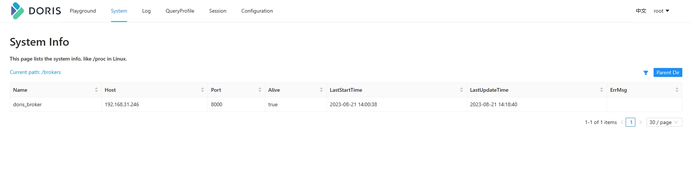

# broker导入

## 部署 FS_Broker

broker 以插件的形式，独立于 Doris 部署。如果需要从第三方存储系统导入数据，需要部署相应的 broker，默认提供了读取 HDFS 、对象存储的 fs_broker。fs_broker 是无状态的，建议每一个 FE 和 BE 节点都部署一个 broker。

- 拷贝源码 fs_broker 的 output 目录下的相应 broker 目录到需要部署的所有节点上。建议和 BE 或者 FE 目录保持同级。【2.0.0版本中，`extensions/` 目录下已含有】

- 修改相应 broker 配置

	在相应 `broker/conf/` 目录下对应的配置文件中，可以修改相应配置。

- 启动 broker

	`bin/start_broker.sh --daemon`

- 添加 broker

	要让 Doris 的 FE 和 BE 知道 broker 在哪些节点上，通过 sql 命令添加 broker 节点列表。

	使用 mysql-client 连接启动的 FE，执行以下命令：

	```
	ALTER SYSTEM ADD BROKER broker_name "broker_host1:broker_ipc_port1","broker_host2:broker_ipc_port2",...;
	```

	其中 

	- broker_host 为 broker 所在节点 ip

	- broker_ipc_port 在 broker 配置文件中的`conf/apache_hdfs_broker.conf`

	- broker_name: 在使用 broker load 导入数据时，需要指定的名称，即 `WITH BROKER "broker_name_1" `. hdfs load 则不需要，使用 `with hdfs`


- 查看 broker 状态

	使用 mysql-client 连接任一已启动的 FE，执行以下命令查看 broker 状态: `SHOW PROC "/brokers";`



## hdfs load

```sql
CREATE TABLE table1
(
    siteid INT DEFAULT '10',
    citycode SMALLINT,
    username VARCHAR(32) DEFAULT '',
    pv BIGINT SUM DEFAULT '0'
)
AGGREGATE KEY(siteid, citycode, username)
DISTRIBUTED BY HASH(siteid) BUCKETS 10
PROPERTIES("replication_num" = "1");

-- 数据
-- 1,1,jim,2
-- 2,1,grace,2
-- 3,2,tom,2
-- 4,3,bush,3
-- 5,3,helen,3

-- 导数据
load label table1_20230821
(
data infile("hdfs://192.168.31.246:9000/in/table1_data") into table table1 COLUMNS TERMINATED BY ","
)
with hdfs
(
"fs.defaultFS"="hdfs://192.168.31.246:9000",
"hdfs_user"="root"
)
PROPERTIES
(
"timeout"="3600",
"max_filter_ratio"="0.1"
);
```

broker 导入是异步命令。以上命令执行成功只表示提交任务成功。

导入是否成功需要通过 `SHOW LOAD` 查看。如：

```sql
SHOW LOAD WHERE LABEL = "table1_20230821";
```

返回结果中，State 字段为 FINISHED 则表示导入成功。

将数据从 hive 导入时，就需要使用 broker load, 此时只需替换为：

```
WITH BROKER "broker_name_1" 
    ( 
      "username" = "hdfs", 
      "password" = "" 
    )
``` 

## 注意

打开 hadoop 后，可能会出现端口占用的情况。