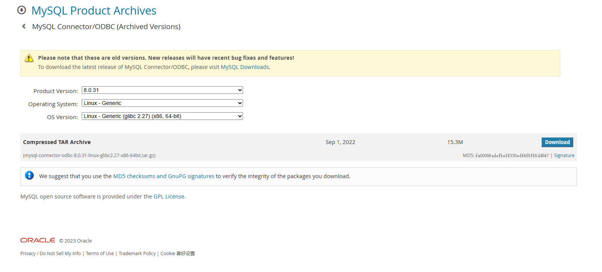

# mysql外部表通过odbc同步数据

[TOC]

## 安装ODBC驱动

安装 unixODBC 驱动

```
sudo wget ftp://ftp.unixodbc.org/pub/unixODBC/unixODBC-2.3.4.tar.gz 
tar -xvzf unixODBC-2.3.4.tar.gz 
cd unixODBC-2.3.4/
sudo ./configure --prefix=/usr/local/unixODBC-2.3.7 --includedir=/usr/include --libdir=/usr/lib -bindir=/usr/bin --sysconfdir=/etc
make
sudo make install
```

查看是否安装成功

```
root@bigdata101:/opt# odbcinst -j
unixODBC 2.3.4
DRIVERS............: /etc/odbcinst.ini
SYSTEM DATA SOURCES: /etc/odbc.ini
FILE DATA SOURCES..: /etc/ODBCDataSources
USER DATA SOURCES..: /root/.odbc.ini
SQLULEN Size.......: 8
SQLLEN Size........: 8
SQLSETPOSIROW Size.: 8
```

安装 mysql ODBC 驱动，先去 [官网](https://downloads.mysql.com/archives/c-odbc/) 下载和 mysql 版本一致的驱动

```
root@bigdata101:~# mysql -uroot -p
Enter password: 
Welcome to the MySQL monitor.  Commands end with ; or \g.
Your MySQL connection id is 9
Server version: 8.0.31 MySQL Community Server - GPL

Copyright (c) 2000, 2022, Oracle and/or its affiliates.

Oracle is a registered trademark of Oracle Corporation and/or its
affiliates. Other names may be trademarks of their respective
owners.

Type 'help;' or '\h' for help. Type '\c' to clear the current input statement.
```



下载、解压、重命名后，注册驱动

```sh
root@bigdata101:/opt/mysql-odbc-8.0.31# bin/myodbc-installer -a -d -n "MySQL ODBC 8.0.31 Unicode Driver" -t "Driver=/opt/mysql-odbc-8.0.31/lib/libmyodbc8w.so"
Success: Usage count is 1
root@bigdata101:/opt/mysql-odbc-8.0.31# bin/myodbc-installer -a -d -n "MySQL ODBC 8.0.31 ANSI Driver" -t "Driver=/opt/mysql-odbc-8.0.31/lib/libmyodbc8a.so"
Success: Usage count is 1
```

查看是否注册成功

```sh
root@bigdata101:/opt/mysql-odbc-8.0.31# bin/myodbc-installer -d -l
MySQL ODBC 8.0 Unicode Driver
MySQL ODBC 8.0 ANSI Driver
MySQL ODBC 8.0.31 Unicode Driver
MySQL ODBC 8.0.31 ANSI Driver
```

配置 ODBC 访问 mysql 的参数

```sh
root@bigdata101:/etc# cat odbc.ini    
[mysql]
Description     = Data source MySQL
Driver          = MySQL ODBC 8.0.31 Unicode Driver
Server          = bigdata101
Host            = 3306
Database        = gmall
Port            = 3306
User            = root
Password        = root
```

```sh
root@bigdata101:/etc# isql -v mysql
+---------------------------------------+
| Connected!                            |
|                                       |
| sql-statement                         |
| help [tablename]                      |
| quit                                  |
|                                       |
+---------------------------------------+
```

在 BE 节点的 `conf/odbcinst.ini` 文件中添加上面注册的驱动，如下

```
[MySQL ODBC 8.0.31 Unicode Driver]
Description     = ODBC for MySQL
Driver          = /opt/mysql-odbc-8.0.31/lib/libmyodbc8w.so
FileUsage       = 1
```

## 创建 ODBC 外部表

mysql中的表

```
mysql> select * from gmall.holiday_info;
+------------+--------------+
| holiday_id | holiday_name |
+------------+--------------+
|          1 | 元旦         |
|          2 | 春节         |
|          3 | 清明         |
|          4 | 劳动节       |
|          5 | 端午节       |
|          6 | 中秋节       |
|          7 | 国庆节       |
+------------+--------------+
7 rows in set (0.01 sec)

mysql> desc gmall.holiday_info;
+--------------+-------------+------+-----+---------+-------+
| Field        | Type        | Null | Key | Default | Extra |
+--------------+-------------+------+-----+---------+-------+
| holiday_id   | int         | NO   | PRI | NULL    |       |
| holiday_name | varchar(20) | YES  |     | NULL    |       |
+--------------+-------------+------+-----+---------+-------+
2 rows in set (0.00 sec)
```

创建 ODBC Resource

```
CREATE EXTERNAL RESOURCE `mysql_test_odbc`
PROPERTIES (
    "type" = "odbc_catalog",
    "host" = "192.168.31.246",
    "port" = "3306",
    "user" = "root",
    "password" = "root",
    "database" = "gmall",
    "odbc_type" = "mysql", 
    "driver" = "MySQL ODBC 8.0.31 Unicode Driver"  -- 上面在 BE 节点的 conf/odbcinst.ini 中添加的信息
);
```

ODBC 相关参数如下：

```
type: 必填，且必须为odbc_catalog。作为resource的类型标识。

user: 外部表的账号，必填。

password: 外部表的密码，必填。

host: 外部表的连接ip地址，必填。

port: 外部表的连接端口，必填。

odbc_type: 标示外部表的类型，当前doris支持mysql与oracle，未来可能支持更多的数据库。引用该resource的ODBC外表必填，旧的mysql外表选填。

driver: 标示外部表使用的driver动态库，引用该resource的ODBC外表必填，旧的mysql外表选填。
```

创建外部表

```sql
CREATE EXTERNAL TABLE `ext_mysql_demo` (
  `holiday_id` int NOT NULL COMMENT "",           -- 字段名和holiday_info一致
  `holiday_name` varchar(20) NOT NULL COMMENT ""
) ENGINE=ODBC
COMMENT "ODBC"
PROPERTIES (
    "odbc_catalog_resource" = "mysql_test_odbc",
    "database" = "gmall",
    "table" = "holiday_info"
);
```

这里我们创建一个 ext_oracle_demo 外部表，并引用了之前创建的 mysql_test_odbc Resource

```sql
mysql> select * from ext_mysql_demo;
+------------+--------------+
| holiday_id | holiday_name |
+------------+--------------+
|          1 | 元旦         |
|          2 | 春节         |
|          3 | 清明         |
|          4 | 劳动节       |
|          5 | 端午节       |
|          6 | 中秋节       |
|          7 | 国庆节       |
+------------+--------------+
7 rows in set (0.09 sec)
```

将数据导入 Doris 表

```sql
CREATE TABLE `doris_oralce_tbl` (
  `holiday_id` int NOT NULL COMMENT "",
  `holiday_name` varchar(20) NOT NULL COMMENT ""
)
COMMENT "Doris Table"
DISTRIBUTED BY HASH(`holiday_id`) BUCKETS 2
PROPERTIES (
    "replication_num" = "1"
);

mysql> insert into doris_oralce_tbl select * from ext_mysql_demo;
Query OK, 7 rows affected (0.41 sec)
{'label':'insert_a1503e91f9ed43dd_95bb5aa47a8287db', 'status':'VISIBLE', 'txnId':'10011'}

mysql> select * from doris_oralce_tbl;
+------------+--------------+
| holiday_id | holiday_name |
+------------+--------------+
|          1 | 元旦         |
|          2 | 春节         |
|          4 | 劳动节       |
|          7 | 国庆节       |
|          3 | 清明         |
|          5 | 端午节       |
|          6 | 中秋节       |
+------------+--------------+
7 rows in set (0.23 sec)
```

